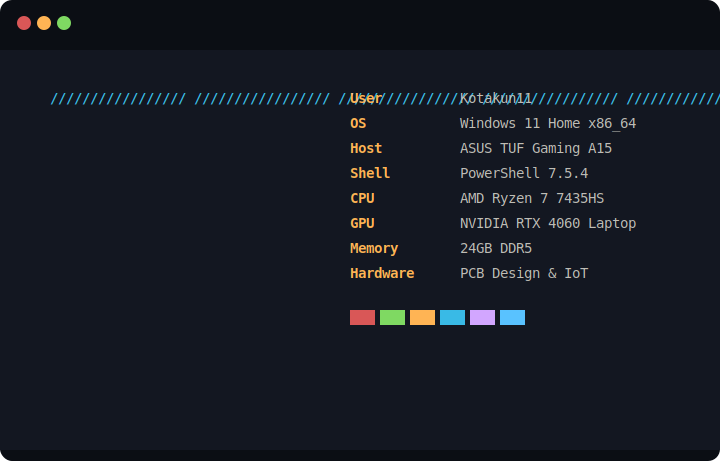

## 💻 My System Fetch

  

# About Me:
🔭 I’m currently working on      The Specifics: "Building mod using PY."      The Goal: "Optimizing my portfolio site for better performance."  🤝 I’m looking for help with      Technical: "PCB layout design in KiCad and sourcing reliable components for high-frequency signal processing."      Design: "Improving the UI/UX of my current side project."  🌱 I’m currently learning      Language/Framework: "Mastering C++ and HTML."      Soft Skills: "Technical writing and clear documentation."  💬 Ask me about      Technical Problems: " I used to work as a Technician so i can support you. "      Hobbies: "Photography, mechanical keyboards, Repairing."  ⚡ Fun fact      "I listen to music for 20 hours everyday ."      "The volume is always at 70% or higher (Because i love Rock & Metal)."      "I love Gacha games."

## Socials:
   

# Tech Stack:
                    

---

